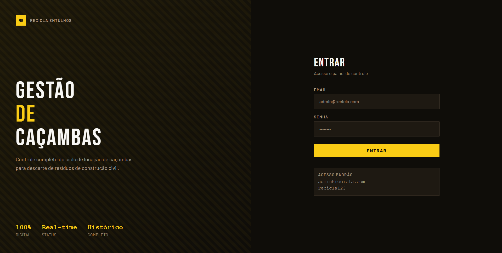

# Recicla Entulhos - Desafio Técnico Tecadi



Este projeto é uma aplicação Full Stack para gerenciamento de caçambas de descarte de resíduos de construção civil, desenvolvida como parte do teste técnico para a Tecadi.

A solução foca em uma experiência de usuário fluida ("Plug and Play"), código limpo e arquitetura robusta.

---

## Como Rodar o Projeto (Docker)

A forma mais simples e recomendada de executar a aplicação é utilizando o **Docker**. Isso garante que todo o ambiente (Frontend, Backend e Banco de Dados) suba automaticamente sem necessidade de instalar Node.js ou PostgreSQL na sua máquina.

### Pré-requisitos

- Docker e Docker Compose instalados.

### Passo a Passo

1. Clone o repositório:

```bash
git clone https://github.com/SchusterN-hub/recicla-entulhos.git
```

2. Execute o comando de build e inicialização na raiz do projeto:

```bash
docker compose up --build
```

3. Aguarde o build terminar. Assim que os containers estiverem rodando, você pode acessar o sistema nesses links:
   - **Frontend (Aplicação):** [http://localhost:4321](http://localhost:4321)
   - **Backend (API):** [http://localhost:3456/api](http://localhost:3456/api)
   - **Swagger (Documentação):** [http://localhost:3456/api/docs](http://localhost:3456/api/docs)

4. O usuário padrão é criado automaticamente na primeira execução:
   - **Email:** `admin@recicla.com`
   - **Senha:** `recicla123`

---

## Tecnologias Utilizadas

### Backend

- **NestJS:** Framework Node.js estruturado e escalável para APIs REST.
- **Prisma ORM:** Mapeamento objeto-relacional com tipagem automática.
- **PostgreSQL:** Banco de dados relacional robusto e confiável.
- **bcrypt:** Hash seguro de senhas.
- **Swagger:** Documentação interativa da API gerada automaticamente.
- **class-validator:** Validação robusta de dados na entrada da API.
- **Axios:** Consumo da API externa ViaCEP para preenchimento automático de endereço.

### Frontend

- **Next.js 14 + React:** Framework com App Router para roteamento baseado em pastas.
- **TypeScript:** Tipagem estática para maior segurança e manutenibilidade.
- **Tailwind CSS:** Estilização utilitária e responsiva.
- **React Hook Form + Zod:** Gerenciamento e validação de formulários.
- **Axios:** Cliente HTTP para comunicação com a API.
- **react-hot-toast:** Feedback visual de ações ao usuário.

### DevOps

- **Docker & Docker Compose:** Containerização com multi-stage build para gerar imagens leves e seguras.

---

## Decisões Técnicas

### 1. Prisma com `db push`

Optei por utilizar o **`prisma db push`** no startup do container em vez de `migrate deploy`.

- **O motivo:** Para testes técnicos plug-and-play, o `db push` sincroniza o schema diretamente com o banco sem exigir arquivos de migração pré-gerados, tornando o setup com Docker completamente automático.
- **Nota para Produção:** Em um cenário real, utilizaria `prisma migrate deploy` com arquivos de migração versionados no repositório, garantindo rastreabilidade de cada alteração no banco.

### 2. Autenticação com bcrypt

A autenticação foi implementada de forma real, com hash seguro de senha.

- **Backend:** O `AuthService` implementa `OnApplicationBootstrap` e cria automaticamente o usuário padrão na primeira inicialização, sem necessidade de seed manual.
- **Frontend:** Cookie de sessão `recicla_auth` definido após login bem-sucedido, com middleware Next.js protegendo todas as rotas autenticadas.

### 3. Validação Dupla (Front e Back)

A integridade dos dados foi priorizada em ambas as camadas.

- **Frontend:** Zod para feedback imediato ao usuário (UX).
- **Backend:** `class-validator` com DTOs para garantir que dados inválidos nunca cheguem ao banco, mesmo que a requisição seja feita via Postman ou Swagger.

### 4. Transações Atômicas

Operações críticas de negócio — criar e finalizar aluguéis — utilizam **`prisma.$transaction`**, garantindo que a atualização do aluguel e do status da caçamba sejam sempre atômicas. Não há risco de inconsistência caso uma das operações falhe.

### 5. Docker Multi-Stage Build

Os `Dockerfile`s foram configurados em múltiplos estágios.

- Primeiro, usamos uma imagem completa (`node:20-slim`) para instalar dependências e compilar o projeto.
- Depois, copiamos apenas os artefatos finais para uma imagem de runtime enxuta.
- Isso reduz o tamanho final das imagens e aumenta a segurança.

---

## Funcionalidades

- **Autenticação real:** Login com email e senha protegido por bcrypt, com usuário padrão criado automaticamente.
- **CRUD de Caçambas:** Cadastro, listagem, edição com filtros por número de série e status.
- **Aluguel com ViaCEP:** Endereço preenchido automaticamente ao digitar o CEP.
- **Previsão de devolução:** Campo de data com destaque visual de **Atrasado** caso o prazo tenha vencido e a caçamba ainda esteja alugada.
- **Histórico completo:** Registro de todos os aluguéis por caçamba, com data de início, previsão e devolução efetiva.
- **Tabelas ordenáveis:** Ordenação por qualquer coluna clicando no cabeçalho.
- **Ações inline:** Alugar e ver histórico diretamente na listagem, sem navegar para outra tela.
- **Feedback visual:** Toasts de sucesso e erro em todas as operações.

---

## Endpoints da API

A API segue o padrão RESTful. Documentação interativa completa disponível em `/api/docs`.

| Método | Endpoint                 | Descrição                           |
| :----- | :----------------------- | :---------------------------------- |
| POST   | `/auth/login`            | Autenticar usuário                  |
| GET    | `/dumpsters`             | Listar caçambas (filtros opcionais) |
| POST   | `/dumpsters`             | Cadastrar nova caçamba              |
| GET    | `/dumpsters/:id`         | Buscar caçamba por ID               |
| PATCH  | `/dumpsters/:id`         | Editar caçamba                      |
| GET    | `/dumpsters/:id/rentals` | Histórico de aluguéis da caçamba    |
| POST   | `/rentals`               | Criar aluguel (consulta ViaCEP)     |
| PATCH  | `/rentals/:id/finish`    | Finalizar aluguel                   |

---

Desenvolvido por **Nicolas Schuster**
